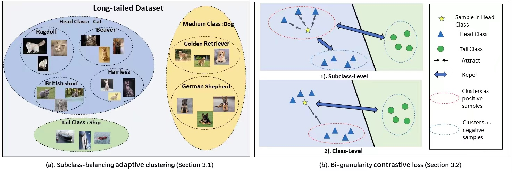

# [ICCV 2023] Subclass-balancing-contrastive-learning
[]([https://arxiv.org/abs/2306.15925])

This repository provides the  code for paper: <br>
**Subclass-balancing Contrastive Learning for Long-tailed Recognition**
<p align="center">
    <br>

  
## Overview
In this paper, we prospose subclass-balancing contrastive learning (SBCL),
a novel supervised contrastive learning defined on subclasses, which are the clusters within each
head class, have comparable size as tail classes, and are adaptively updated during the training.
Instead of sacrificing instance-balance for class-balance, our method achieves both instance- and
subclass-balance by exploring the head-class structure in the learned representation space of the
model-in-training. In particular, we propose a bi-granularity contrastive loss that enforces a sample
(1) to be closer to samples from the same subclass than all the other samples; and (2) to be closer to
samples from a different subclass but the same class than samples from any other subclasses. While
the former learns representations with balanced and compact subclasses, the latter preserves the class
structure on subclass level by encouraging the same class’s subslasses to be closer to each other than
to any different class’s subclasses. Hence, it can learn an accurate classifier distinguishing original
classes while enjoy both the instance- and subclass-balance.
## Requiremenmts
* ImageNet dataset
* Python ≥ 3.6
* PyTorch ≥ 1.4
* scikit-learn
## CIFAR dataset
The code will help you download the CIFAR dataset automatically. Only change the `--dataset` and `--imb_factor` can change the CIFAR dataset.
### First-stage train
To perform SBCL using 2-gpu machines, run:
<pre>python SimCLR/main.py \ 
  --dataset 'cifar100' \ 
  --imb_factor 0.01 \
  --lr 0.5\
  --batch_size 1024 \
  --temperature 0.1 
</pre>
NOTE:
For the CIFAR-10 datasets, we should increase steps for updaing the clusters.

### Second-stage train
To evalute the representation learning, our code support [Classifier-Balancing](https://arxiv.org/abs/1910.09217) and [LDAM](https://arxiv.org/abs/1906.07413) to learn the classify.
We report the accuracy of LDAM in this paper.
#### LDAM training 
<pre>python SimCLR/linear_classify.py  \
  --dataset 'cifar100' \ 
  --imb_factor 0.01 \
  --train_rule 'DRW' \
  --epochs 200 
</pre>
#### Classifier-Balancing  training 
<pre>python SimCLR/linear_classify.py  \
  --dataset 'cifar100' \ 
  --imb_factor 0.01 \
  --train_rule 'CB' \
  --epochs 45 
</pre>

## ImageNet-LT dataset
You should download [ImageNet-LT](http://image-net.org/download) dataset manually, and place them in your `data_root`. Long-tailed version will be created using train/val splits (.txt files) in corresponding subfolders under `moco/imagenet_lt`.
You should change the `data_root` and `save_folder` in [`moco/sbcl.py`](.moco/sbcl.py) and [`moco/linear_classify.py`](.moco/linear_classif.py) accordingly for ImageNet-LT.
### First-stage train
To perform SBCL using 8-gpu machines, run:
<pre>python moco/sbcl.py \ 
  -a resnet50 \ 
  --lr 0.1 \
  --batch_size 256 \
  --temperature 0.07\
  --dist-url 'tcp://localhost:10001' --multiprocessing-distributed --world-size 1 --rank 0 
</pre>

### Second-stage train
To evalute the representation learning, run:
<pre>python moco/linear_classsify.py 
  --pretrained [your pretrained model] \
  -a resnet50 \ 
  --lr 10 \
  --batch_size 2048 \
  --train_rule 'CB'\
  --epochs 40 --schedule 20 30 --seed 0
</pre>
NOTE: 
In this code, we also can use [LDAM](https://arxiv.org/abs/1906.07413) loss to train the linear classifier on top of the representation. Many/medium/minor classes accuracy could change significantly with different learning rate or batch size in the second stage while overall accuracy remains the same.

## Citation
If you find MADAug helpful in your research, please consider citing: 
```bibtex   
@article{hou2023subclass,
  title={Subclass-balancing contrastive learning for long-tailed recognition},
  author={Hou, Chengkai and Zhang, Jieyu and Wang, Haonan and Zhou, Tianyi},
  journal={arXiv preprint arXiv:2306.15925},
  year={2023}
}
```
## Acknowledgement
This code inherits some codes from [MoCo](https://github.com/facebookresearch/moco), [Classifier-Balancing](https://github.com/facebookresearch/classifier-balancing) and [LDAM](https://arxiv.org/abs/1906.07413).
